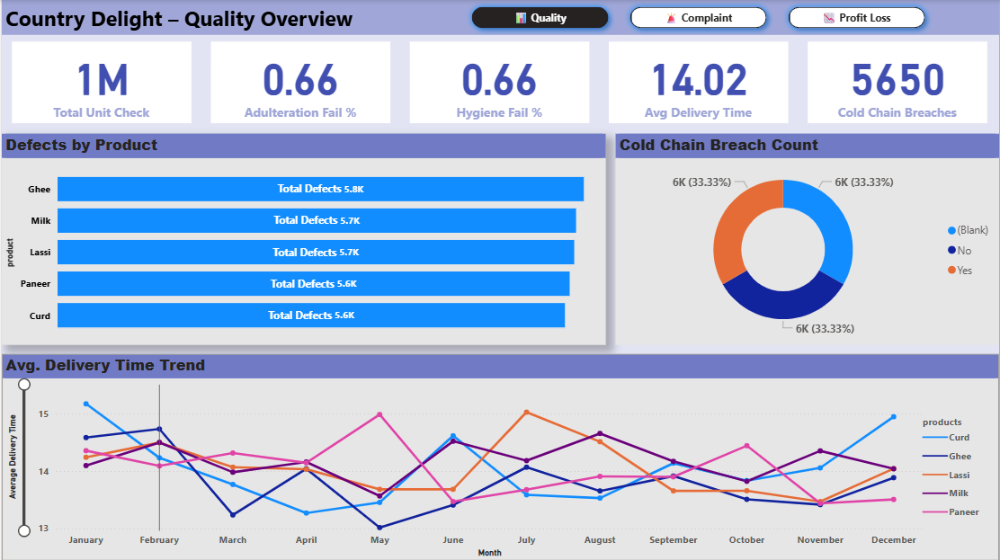
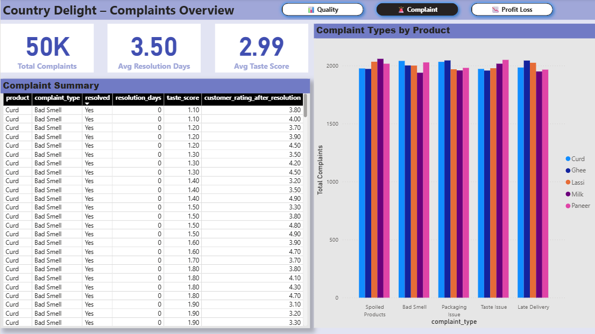
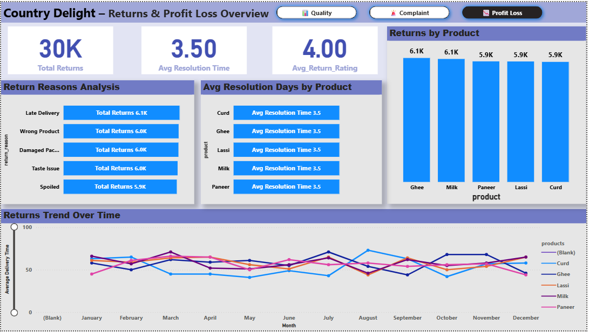

# 🧠 Country Delight – CEO Quality Dashboard

This Power BI project simulates a real-world enterprise dashboard for Country Delight's CEO, helping monitor key **product quality, complaints**, and **returns** metrics using visually clean and actionable insights.

---

## 📁 Dashboard Sections

1. 📊 **Overview Dashboard** – Key product quality indicators (Fat %, SNF %, Batch Temp)
2. 🚨 **Complaints Analysis** – Complaints by product, issue type, resolution time
3. ↩️ **Returns Dashboard** – Product return trends, reasons, and resolution metrics

---

## 📦 Datasets Used

- `quality_data.csv` – Product-level quality metrics
- `returns_data.csv` – Return requests with reasons and resolution
- `complaint_data.csv` – Complaints data, rating, reason to return etc.

---

## 📸 Dashboard Preview

---

## 📂 Files Included

- `dashboard.pbix`
- `quality_data.csv`, `returns_data.csv`, `complaint_data.csv`
- `quality.png`, `complaints.png`, `profitloss.png`
- `README.md`

---

## ✅ Tools Used

- Power BI Desktop
- Python (for dataset simulation)

---

## ✨ Outcome

This project demonstrates:
- Realistic quality control dashboard creation
- Clean UI with navigation buttons
- Practical use of DAX, slicers, KPI cards, and conditional formatting

---

## 📬 Contact

> Created by **[Rutikesh Pawar]**  
> [https://www.linkedin.com/in/rutikeshpawar227/]

